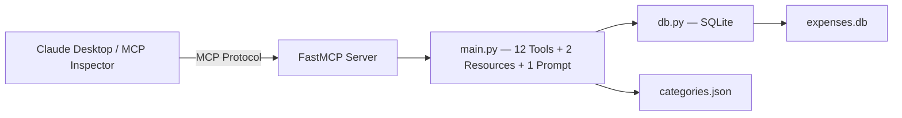

# 💰 ExpenseIQ (MCP Server)

> A production-grade **Model Context Protocol (MCP)** server for personal expense tracking — powered by SQLite, designed for Claude Desktop, and ready for remote deployment.

[](https://www.python.org/)
[](https://modelcontextprotocol.io/)
[](https://github.com/jlowin/fastmcp)

**Live Server URL:** [https://expenseiq.fastmcp.app/mcp](https://expenseiq.fastmcp.app/mcp)

---

## ✨ Feature Highlights

| Feature | Description |
|---|---|
| **15 Tools** | Add, list, edit, delete, search, summarize, trend, budget, breakdown — plus **editable categories** |
| **Fully Async** | Non-blocking I/O using `aiosqlite` for high performance |
| **Budget Tracking** | Set monthly limits per category, get over-budget warnings with utilization % |
| **Trend Analysis** | Month-over-month spending trends for the last N months |
| **CSV Export** | Export filtered expenses as CSV — paste directly into Google Sheets / Excel |
| **Smart Search** | Full-text search across notes and tags |
| **Editable Categories** | Pre-seeded with 100+ subcategories, fully editable via `add_category` / `remove_category` |
| **Input Validation** | Category, date, amount, and payment method validation on every operation |
| **Currency: ₹ INR** | All responses include `currency: "INR"` for clarity |
| **Prompt Templates** | Built-in `monthly_report` prompt for structured expense analysis |
| **Pagination** | Large result sets with `limit` / `offset` support |

---

## 🏗️ Architecture



---

## 🚀 Quick Start

### Prerequisites

- **Python 3.13+**
- **[uv](https://docs.astral.sh/uv/)** — fast Python package manager
- **Node.js / npx** — for MCP Inspector (optional)
- **Claude Desktop** — to use the server as an AI assistant

### 1. Clone & Install

```bash
git clone https://github.com/Aricode2005/expense-tracker-mcp.git
cd expense-tracker-mcp
uv sync
```

### 2. Test with MCP Inspector

```bash
npx @modelcontextprotocol/inspector uv run main.py
```

This opens a web UI where you can interactively call all 12 tools, read resources, and test prompts.

### 3. Install in Claude Desktop

Open your Claude Desktop config file:

- **Windows**: `%APPDATA%\Claude\claude_desktop_config.json`
- **macOS**: `~/Library/Application Support/Claude/claude_desktop_config.json`

Add this entry:

```json
{
  "mcpServers": {
    "expense-tracker": {
      "command": "uv",
      "args": [
        "run",
        "--directory",
        "C:\\Users\\aritr\\Downloads\\AgenticAI\\MCP\\epense_tracker-mcp",
        "main.py"
      ]
    }
  }
}
```

> 💡 Replace the path with your actual project directory.

Restart Claude Desktop. You should see the **ExpenseTracker** server in the MCP tools panel (🔌 icon).

---

## 🛠️ Tool Reference

### Core CRUD

| Tool | Description |
|---|---|
| `add_expense` | Add expense with date, amount, category, subcategory, note, payment method, tags, recurring flag |
| `get_expense` | Fetch a single expense by ID |
| `edit_expense` | Update any field(s) of an existing expense |
| `delete_expense` | Delete an expense by ID (returns deleted record) |

### Query & Search

| Tool | Description |
|---|---|
| `list_expenses` | List expenses in a date range with filters (category, amount range, payment method, tag) + pagination |
| `search_expenses` | Full-text search across notes and tags |

### Analytics

| Tool | Description |
|---|---|
| `summarize_expenses` | Aggregate by category / subcategory / month / day with count, total, avg, min, max |
| `get_monthly_trend` | Month-over-month spending totals for the last N months |
| `get_category_breakdown` | Subcategory-level breakdown for a single category |

### Budgets

| Tool | Description |
|---|---|
| `set_budget` | Set or update a monthly budget limit for a category |
| `get_budget_status` | Compare actual vs budget with utilization %, over-budget warnings |

### Export

| Tool | Description |
|---|---|
| `export_expenses` | Export expenses as CSV text for spreadsheets |

### Resources

| URI | Description |
|---|---|
| `expense://categories` | Full category → subcategory mapping (JSON) |
| `expense://stats` | Live dashboard: totals, this month, top categories |

### Prompts

| Prompt | Description |
|---|---|
| `monthly_report` | Generates a structured monthly report with summaries, budgets, and trend analysis |

---

## 📂 Project Structure

```
expense-tracker-mcp/
├── main.py              # MCP server — 12 tools, 2 resources, 1 prompt
├── db.py                # Database schema, init, connection helpers
├── categories.json      # 20 categories with 100+ subcategories
├── pyproject.toml       # Project config (uv / pip)
├── README.md            # You are here
└── src/
    └── epense_tracker_mcp/
        └── __init__.py  # Package entry point
```

---

## 💬 Example Conversations with Claude

Once installed in Claude Desktop, try:

> **"Add an expense of ₹450 for groceries today, paid via UPI"**

> **"Show me my spending for September 2026"**

> **"Set a monthly budget of ₹5000 for food"**

> **"Am I over budget this month?"**

> **"What's my month-over-month spending trend?"**

> **"Export this month's expenses as CSV"**

> **"Search for expenses tagged 'client-x'"**

> **"Break down my food spending by subcategory"**

---

## 🗄️ Database Schema

### `expenses` table

| Column | Type | Description |
|---|---|---|
| `id` | INTEGER PK | Auto-incrementing ID |
| `date` | TEXT | Date in YYYY-MM-DD format |
| `amount` | REAL | Amount in ₹ INR (must be > 0) |
| `category` | TEXT | e.g. food, transport, health |
| `subcategory` | TEXT | e.g. groceries, cab_ride_hailing |
| `note` | TEXT | Free-text description |
| `payment_method` | TEXT | cash / upi / credit_card / debit_card / net_banking / wallet |
| `is_recurring` | INTEGER | 0 or 1 |
| `tags` | TEXT | Comma-separated tags |
| `created_at` | TEXT | ISO-8601 timestamp |
| `updated_at` | TEXT | ISO-8601 timestamp |

### `budgets` table

| Column | Type | Description |
|---|---|---|
| `id` | INTEGER PK | Auto-incrementing ID |
| `category` | TEXT UNIQUE | One budget per category |
| `monthly_limit` | REAL | Monthly cap in ₹ INR |
| `created_at` | TEXT | ISO-8601 timestamp |

---

## 🌐 Remote Deployment

This server has **three transport modes** built in — no Docker needed:

```bash
# Local (MCP Inspector / Claude Desktop)
python main.py

# Remote — modern streamable-http (recommended)
python main.py --remote

# Remote — legacy SSE
python main.py --sse
```

The `PORT` environment variable is respected (default: `8000`).

### Deploy to a Cloud Platform (Railway / Render / Fly.io)

1. Push this repo to GitHub.
2. Link the repo in your cloud platform.
3. Set the **Start Command** to:
   ```
   python main.py --remote
   ```
4. The platform injects `PORT` automatically — the server binds to it.

### Connect Claude Desktop to a Remote Server

Use `npx` to bridge the remote HTTP server into a local STDIO connection for Claude Desktop.

Add this to your `claude_desktop_config.json`:

```json
{
  "mcpServers": {
    "expense-iq-remote": {
      "command": "npx",
      "args": [
        "-y",
        "@modelcontextprotocol/inspector",
        "mcp-remote",
        "https://expenseiq.fastmcp.app/mcp"
      ]
    }
  }
}
```

> **Note:** The `mcp-remote` command from the inspector package acts as a bridge, allowing Claude Desktop (which expects local STDIO) to communicate with your cloud-hosted HTTP server.

### Test Remote Mode Locally

```bash
# Terminal 1 — start the server
python main.py --remote

# Terminal 2 — connect MCP Inspector to it
npx @modelcontextprotocol/inspector
# Then set Transport Type to "Streamable HTTP"
# and URL to http://localhost:8000/mcp
```

---

## 🛣️ Roadmap

- [x] **Remote Deployment** — Built-in SSE transport support
- [x] **Fully Async** — Converted to `aiosqlite`
- [x] **Editable Categories** — Categories managed in SQLite
- [ ] **Authentication** — API key / OAuth for multi-user support
- [ ] **Income Tracking** — Track income alongside expenses for net savings
- [ ] **Recurring Automation** — Auto-add recurring expenses monthly
- [ ] **Data Visualization** — Generate charts (spending pie, trend line) as image resources
- [ ] **Multi-currency** — Support USD, EUR with conversion rates
- [ ] **Receipt OCR** — Extract expense data from receipt images via MCP resources

---

## 🧰 Tech Stack

| Technology | Purpose |
|---|---|
| **Python 3.13** | Runtime |
| **FastMCP** | MCP server framework (Async, SSE, STDIO) |
| **SQLite (aiosqlite)** | Embedded database (WAL mode, non-blocking) |
| **Model Context Protocol** | AI-tool communication standard |
| **uv** | Package management & script runner |

---

## 👤 Author

**Aritra Dutta** — [GitHub](https://github.com/Aricode2005) · [Email](mailto:aritraduttauttarpara@gmail.com)


